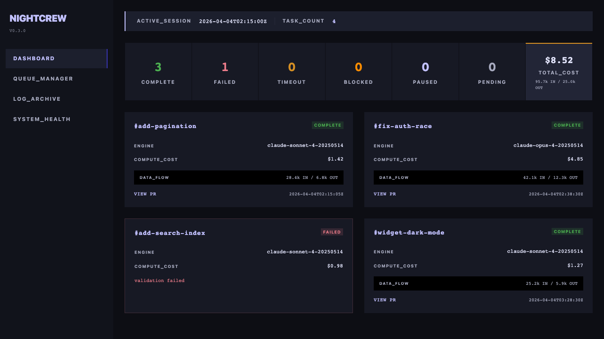
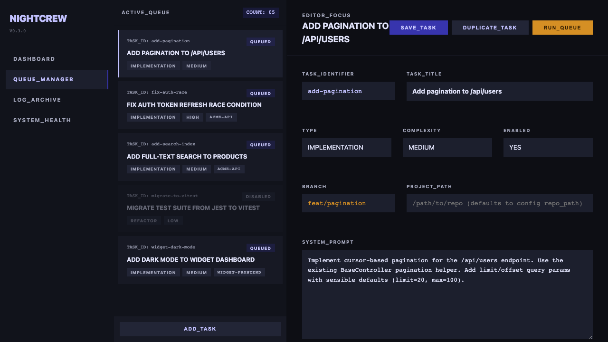
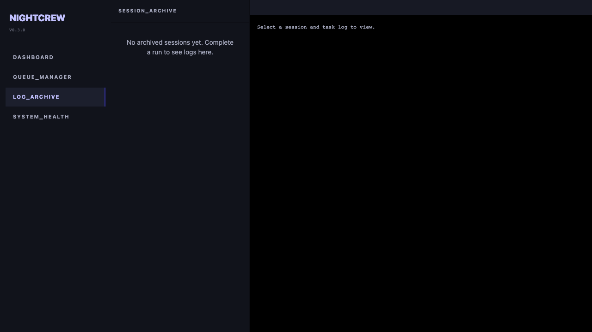
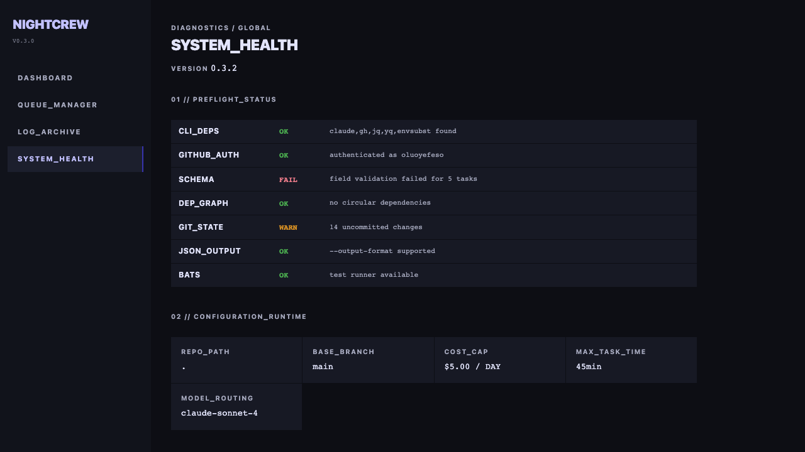

# NightCrew

Queue tasks across repos before bed. Wake up to draft PRs.

NightCrew is an overnight autonomous task orchestrator for Claude Code. It runs each task in an isolated git worktree, routes it to the appropriate Claude model, enforces 7 layers of safety guardrails, and creates draft PRs with decision logs.



## How It Works

NightCrew doesn't just run your prompt and hope for the best. Each task goes through a 3-phase pipeline that separates thinking from doing:

```
 YOU (before bed)
  │  Write tasks.yaml
  │  Run ./nightcrew.sh run
  ▼
 ┌─────────────────────────────────────────┐
 │  For each task:                         │
 │                                         │
 │  1. PLAN (Opus)                         │
 │     Scope challenge, architecture       │
 │     review, test coverage plan,         │
 │     failure mode analysis               │
 │     → Saves PLAN-{task-id}.md           │
 │                                         │
 │  2. IMPLEMENT (Sonnet)                  │
 │     Follows the plan precisely.         │
 │     Writes code, runs tests.            │
 │     Logs decisions to DECISIONS.md      │
 │                                         │
 │  3. REVIEW (Sonnet)                     │
 │     Pre-landing code review.            │
 │     Auto-fixes mechanical issues.       │
 │     Logs concerns to REVIEW.md          │
 │                                         │
 │  Then: validate, commit, push, draft PR │
 └─────────────────────────────────────────┘
  │
  ▼
 YOU (next morning)
  Run ./nightcrew.sh review
  Open draft PRs with decision logs
```

Opus does the hard thinking (architecture, edge cases, test planning). Sonnet follows clear instructions. By the time you review in the morning, each PR has a plan, a decision log, and a review report.

## Prerequisites

Install these CLI tools before running NightCrew:

| Tool | Install | Purpose |
|------|---------|---------|
| `claude` | [Claude Code CLI](https://docs.anthropic.com/en/docs/claude-code) | AI task execution |
| `gh` | `brew install gh` then `gh auth login` | GitHub PR creation |
| `jq` | `brew install jq` | JSON processing |
| `yq` | `brew install yq` | YAML processing |
| `envsubst` | `brew install gettext` | Template rendering |
| `node` | [nodejs.org](https://nodejs.org) | Web UI server (optional, for `nightcrew serve`) |

## Quick Start

```bash
# 1. Clone and enter the repo
git clone <repo-url> && cd nightcrew

# 2. Make the script executable
chmod +x nightcrew.sh

# 3. Copy the example tasks file
cp tasks.yaml.example tasks.yaml

# 4. Edit tasks.yaml with your actual tasks
vim tasks.yaml

# 5. Review config.yaml (cost caps, models, protected branches)
vim config.yaml

# 6. Dry run to verify everything looks right
./nightcrew.sh run --dry-run

# 7. Run for real
./nightcrew.sh run

# 8. Next morning — review results
./nightcrew.sh review
```

## Defining Tasks

Edit `tasks.yaml` to define your task queue. Each task needs at minimum:

```yaml
tasks:
  - id: my-task-id              # Unique identifier
    title: "Short description"   # Shown in PR title and logs
    branch: fix/my-feature       # Branch name (auto-created)
    type: implementation         # implementation | test | refactor | research
    prompt: |
      Detailed instructions for Claude about what to do.
```

Optional fields for more control:

```yaml
    complexity: medium           # low | medium | high (affects model routing)
    enabled: true                # Set to false to skip this task without deleting it
    project_path: /path/to/repo  # Target a different repo (absolute path, must be a git repo)
    goal: |                      # Acceptance criteria
      - Tests pass
      - No regressions
    files_in_scope:              # Glob patterns — Claude can ONLY modify these
      - src/auth/**
      - tests/auth/**
    max_time_minutes: 30         # Task timeout (default: 45 from config)
    test_command: "npm test"     # Runs after task completes for validation
    depends_on:                  # Task IDs that must complete first
      - my-other-task
```

Tasks with `depends_on` are skipped (marked `blocked`) if their dependencies haven't completed. List tasks in dependency order in your YAML.

See `tasks.yaml.example` for full examples. Task files are validated against `schemas/task.schema.json` at startup.

## Task Types

| Type | Best For | Default Model |
|------|----------|---------------|
| `implementation` | Features, bug fixes | Sonnet (Opus if high complexity) |
| `test` | Adding/improving tests | Sonnet (Opus if high complexity) |
| `refactor` | Code restructuring | Sonnet (Opus if high complexity) |
| `research` | Investigation, docs | Always Sonnet |

## Configuration

Edit `config.yaml` to control global behavior:

```yaml
repo_path: .                    # Target repository path
max_cost_cents: 500             # $5 cost cap per session
max_task_time_minutes: 45       # Default timeout per task

models:
  default: claude-sonnet-4-20250514   # Low/medium complexity
  complex: claude-opus-4-20250514     # High complexity

protected_branches:             # NightCrew will NEVER touch these
  - main
  - master
  - develop
  - production

pr_defaults:
  draft: true                   # Create as draft PRs
  base: main                    # PR target branch
```

## CLI Reference

```
nightcrew.sh run [OPTIONS]        Run the task queue
nightcrew.sh review [OPTIONS]     Morning review dashboard
nightcrew.sh serve [OPTIONS]      Start the web UI (http://127.0.0.1:3721)
nightcrew.sh preflight [OPTIONS]  Run preflight checks
nightcrew.sh config [OPTIONS]     Show resolved configuration
nightcrew.sh enable <task-id>     Enable a task
nightcrew.sh disable <task-id>    Disable a task
nightcrew.sh sessions [OPTIONS]   List archived sessions

Options:
  --tasks FILE      Path to tasks.yaml (default: ./tasks.yaml)
  --config FILE     Path to config.yaml (default: ./config.yaml)
  --dry-run         Preflight validation + show what would run
  --open            Open HTML dashboard in browser (with review)
  --json            Output as JSON (for preflight, config, sessions)
  --port PORT       Server port (default: 3721, for serve)
  --version         Show version
  --help            Show help
```

## Multi-Project Support

Queue tasks across multiple repositories in a single overnight run:

```yaml
tasks:
  - id: api-pagination
    title: "Add pagination to /api/users"
    branch: feat/pagination
    type: implementation
    prompt: "Implement cursor-based pagination..."
    project_path: /Users/me/acme-api

  - id: frontend-dark-mode
    title: "Add dark mode toggle"
    branch: feat/dark-mode
    type: implementation
    prompt: "Implement dark mode..."
    project_path: /Users/me/widget-frontend
```

Each task creates its worktree under the specified project's `.worktrees/` directory. Tasks without `project_path` use the default `repo_path` from config.yaml. The `protected_branches` list applies to all projects.

## Safety Guardrails

NightCrew enforces 7 layers of protection so you can run it unattended:

1. **Tool restrictions** — Each task type gets a whitelist of allowed tools (research tasks can't write files, etc.)
2. **Blocked operations** — `rm`, `sudo`, `chmod`, `ssh`, `npm publish`, force-push, and destructive HTTP methods are always blocked
3. **Branch protection** — Will never checkout or push to main/master/develop/production
4. **File scope enforcement** — Tasks can only modify files matching their `files_in_scope` globs; out-of-scope changes are reverted
5. **Timeout enforcement** — Each task is killed after its `max_time_minutes`
6. **Cost cap** — Session stops when cumulative cost exceeds `max_cost_cents`
7. **Secret scanning** — Post-task validation checks for accidentally committed secrets

## Rate Limit Handling

If Claude hits a rate limit, NightCrew automatically:
- Commits work-in-progress
- Sleeps with exponential backoff (5m, 10m, 20m, 40m, 60m)
- Retries up to 5 times
- Resumes where it left off

## Running on a Schedule

```bash
# Run every night at midnight
echo "0 0 * * * cd /path/to/nightcrew && ./nightcrew.sh run" | crontab -
```

## Web UI

NightCrew includes a web-based operations console for managing tasks and viewing results.

```bash
# Install Node dependency (one-time)
npm install

# Start the web UI
./nightcrew.sh serve
# Opens http://127.0.0.1:3721
```

The web UI has 4 pages:

**Dashboard** -- Live task status, stats, cost tracking


**Queue Manager** -- Add, edit, enable/disable tasks, configure multi-project paths



**Log Archive** -- Browse past sessions and read full execution logs per task/phase



**System Health** -- Preflight status, version, config viewer



The server is localhost-only (127.0.0.1) with no authentication. It reads and writes the same local files as the CLI.

## Output

After a run, you'll find:
- **`state/progress.json`** — Task statuses, costs, PR URLs, timing
- **`state/sessions/{timestamp}/`** — Archived session with progress snapshot and logs
- **Draft PRs** on GitHub — One per completed task
- **`DECISIONS-*.md`** — Decision logs when Claude made judgment calls
- **macOS notification** — If enabled, a native notification on completion
- **Webhook** — If configured, a JSON POST to your Slack/Discord

Run `./nightcrew.sh review` for a formatted summary, or `./nightcrew.sh review --open` to open the HTML dashboard. Or start the full web UI with `./nightcrew.sh serve`.

## Architecture

See [nightcrew-architecture.md](nightcrew-architecture.md) for the full design document including the orchestrator loop, model routing matrix, prompt template system, and implementation roadmap.

## Contributing

See [CONTRIBUTING.md](CONTRIBUTING.md) for setup instructions, project structure, and how to submit PRs.

## License

[MIT](LICENSE)
